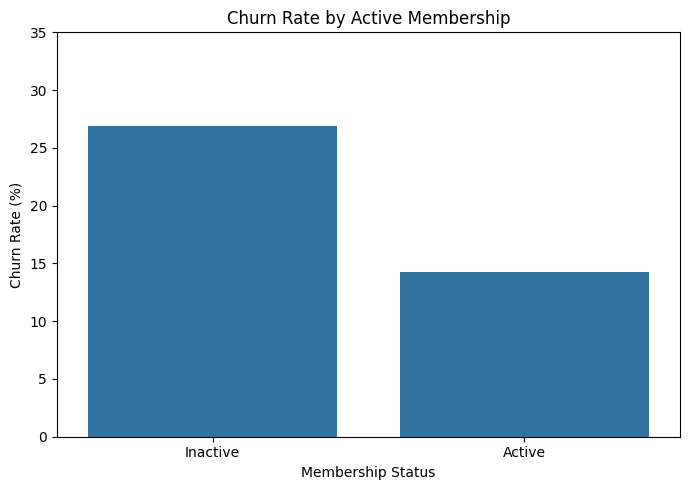
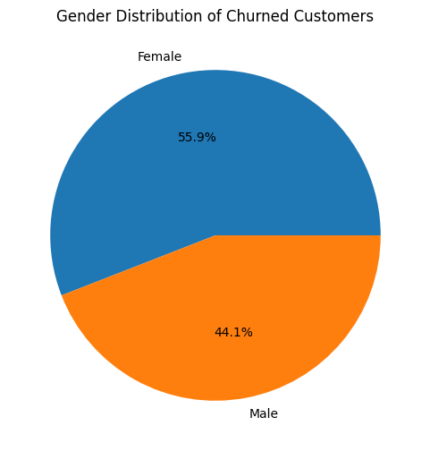
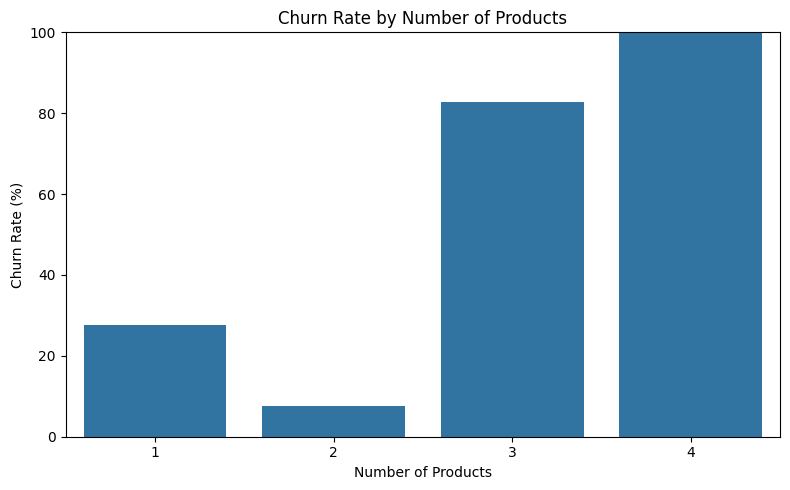
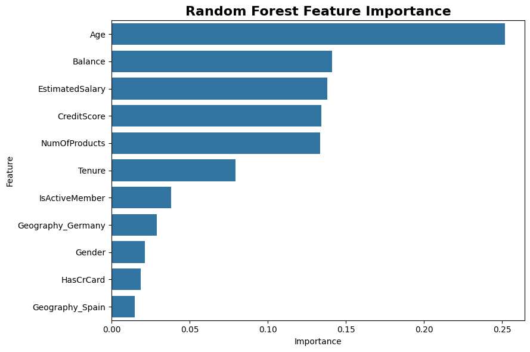

# Customer Churn Prediction

### Turning customer data into churn signals, predictive insights, and retention opportunities

> **What does customer churn look like, where is it concentrated, and which customer characteristics can help us identify it?**

This project analyzes **10,000 banking customers** to understand observed churn patterns and build a classification model for identifying customers who are more likely to exit.

The focus is not only on prediction, but on connecting the analysis to a business question: **where should a retention team look first?**

---

## The Business Problem

Customer churn is a business risk because every exited customer represents a relationship that was not retained.

The objective of this project is to:

* identify patterns associated with customer churn,
* compare classification models,
* evaluate the trade-off between identifying churners and generating false positives,
* and translate the findings into practical areas for further retention analysis.

---

## At a Glance

| Metric             |     Result |
| ------------------ | ---------: |
| Customers          | **10,000** |
| Customers Exited   |  **2,037** |
| Customers Retained |  **7,963** |
| Observed Churn     | **20.37%** |

Approximately **1 in 5 customers** in the dataset exited.

Because churn is the minority class, evaluating the model using accuracy alone would not tell the full story. Precision, recall, and F1-score are therefore important when assessing how well the model identifies customers who actually churned.

---

# What the Data Revealed

## 1. Churn Is Concentrated in Specific Markets


Germany recorded an observed churn rate of **32.44%**, compared with **16.15% in France** and **16.67% in Spain**.

The German segment therefore stands out clearly in the analysis, with an observed churn rate roughly twice that of France and Spain.

### Business takeaway

Germany is the clearest geographic segment to investigate further. The next question for the business is **what differs in this market** — for example, customer experience, product usage, pricing, or retention activity.

This analysis identifies a geographic **signal**, not a causal explanation.

---

## 2. Customer Activity Shows a Strong Churn Gap



Inactive customers had an observed churn rate of approximately **26.85%**, compared with **14.27% among active customers**.

That is a substantial difference in observed churn between the two groups.

### Business takeaway

Customer activity should be considered when prioritizing customers for retention analysis. **Inactive customers represent a higher-observed-churn segment** and may warrant earlier investigation or engagement-focused intervention.

The finding shows an association in this dataset; it does not establish that inactivity itself causes churn.

---

## 3. Gender Shows a Noticeable Difference in Observed Churn


Female customers represented **45.4% of the overall customer base**, but accounted for **55.9% of churned customers**. Male customers represented **54.6% of the customer base** and accounted for **44.1% of churned customers**.

Looking within each group, the observed churn rate was **25.07% for female customers** compared with **16.46% for male customers**.

### Business takeaway

Female customers are overrepresented among churned customers and also show a higher observed churn rate within their group.

However, gender should **not** be used as a standalone targeting rule. The more useful business question is whether this difference remains after considering other characteristics such as **age, geography, and customer activity**.

---

## 4. Product Count Reveals an Unusual Churn Pattern


Observed churn varies sharply across product-count groups:

| Number of Products | Customers | Observed Churn |
| -----------------: | --------: | -------------: |
|                  1 |     5,084 |         ~27.7% |
|                  2 |     4,590 |          ~7.6% |
|                  3 |       266 |         ~82.7% |
|                  4 |        60 |       **100%** |

The pattern is striking, but the smaller groups need to be interpreted carefully.

Only **266 customers had three products** and **60 customers had four products**.

### Business takeaway

The three- and four-product groups should be treated as **investigation signals**, not as evidence that having more products causes customers to leave.

The business should examine why these smaller segments behave differently before considering any product-related retention strategy.

---

# From EDA to Prediction

The exploratory analysis identified several visible churn patterns. I then tested whether customer characteristics could be used to build a predictive classification model.

## Models Evaluated

### Decision Tree

The Decision Tree achieved:

* **78.45% accuracy**
* **0.46 precision** for churn
* **0.50 recall** for churn
* **0.48 F1-score** for churn

### Random Forest

The Random Forest improved performance to:

* **86.60% accuracy**
* **0.77 precision** for churn
* **0.46 recall** for churn
* **0.57 F1-score** for churn

The Random Forest was configured with `class_weight="balanced"` to account for the unequal distribution between retained and churned customers.

---

# Accuracy Is Not the Whole Story


The model results reveal an important business trade-off.

At the default threshold, the Random Forest achieved **86.60% accuracy** and **0.77 precision** for the churn class, but its churn recall was **0.46**.

In other words, the model was relatively precise when it predicted churn, but it did not identify every customer who eventually churned.

I therefore tested a lower probability threshold of **0.30**.

| Random Forest     | Precision |   Recall |       F1 |
| ----------------- | --------: | -------: | -------: |
| Default threshold |  **0.77** | **0.46** | **0.57** |
| Threshold = 0.30  |  **0.57** | **0.66** | **0.62** |

At the 0.30 threshold, recall increased from **46% to 66%**, while precision decreased from **77% to 57%**. Overall accuracy changed from **86.60% to 84.00%**.

### Business takeaway

This is where churn prediction becomes a business decision rather than just a model score.

A retention team may prefer **higher recall** if missing a potential churner is more costly than contacting an additional customer.

A team with limited intervention capacity may instead prefer **higher precision**.

The appropriate threshold should ultimately be selected using validation data and the business cost of false positives versus false negatives.

---

# What Did the Model Learn?


The Random Forest's impurity-based feature importance ranked:

1. **Age**
2. **Estimated Salary**
3. **Credit Score**
4. **Balance**
5. **Number of Products**
6. **Tenure**
7. **IsActiveMember**
8. **Geography — Germany**
9. **Gender**
10. **HasCrCard**
11. **Geography — Spain**

### Interpretation

**Age was the strongest feature used by the Random Forest**, followed by Estimated Salary, Credit Score, Balance, and Number of Products.

This tells us which variables were particularly useful to the model when distinguishing customers who stayed from those who exited.

It does **not** mean these variables independently cause churn.

---

# Key Business Insights

The analysis points to four areas that deserve attention:

**Geography:** Germany shows substantially higher observed churn than France and Spain.

**Engagement:** Inactive customers show a much higher observed churn rate than active customers.

**Gender:** Female customers are overrepresented among churned customers and have a higher observed churn rate within their group.

**Product profile:** Customers with three or four products show unusually high observed churn, although these groups are small and require further validation.

Together, these findings suggest that churn is **not evenly distributed across the customer base**. The most useful next step is therefore not a single broad retention campaign, but **more targeted segmentation and investigation of the highest-risk customer profiles**.

---

# Business Recommendations

### 1. Investigate the German customer segment

The difference between Germany (**32.44%**) and France (**16.15%**) / Spain (**16.67%**) is large enough to justify deeper investigation.

### 2. Prioritize inactive customers for retention analysis

With observed churn of **26.85% versus 14.27%** among active members, inactive customers represent a clear segment for further engagement analysis.

### 3. Investigate the gender gap rather than targeting by gender alone

The observed difference between female (**25.07%**) and male (**16.46%**) churn should be examined alongside age, geography, and activity to determine whether other variables explain the gap.

### 4. Examine customers with three or four products

The unusually high observed churn in these groups is worth investigating, but the small sample sizes mean the finding should be validated before being used to guide a business policy.

---

# Data Preparation

The dataset was checked for missing values, and the notebook analysis found **no missing observations**.

The following identifier-like columns were removed before modeling:

* `RowNumber`
* `CustomerId`
* `Surname`

Categorical variables were transformed using binary mapping and one-hot encoding.

---

# Project Workflow

```text
Business Problem
       ↓
Dataset Understanding
       ↓
Data Quality Assessment
       ↓
Exploratory Data Analysis
       ↓
Feature Preprocessing
       ↓
Train/Test Split
       ↓
Decision Tree
       ↓
Random Forest
       ↓
Model Evaluation
       ↓
Threshold Analysis
       ↓
Feature Interpretation
       ↓
Business Insights
       ↓
Recommendations
```

---

# Technologies

**Python · Pandas · NumPy · Matplotlib · Seaborn · Scikit-learn · Google Colab**

---

# Limitations

* The dataset does not provide longitudinal customer behavior.
* Observed relationships should not be interpreted as causal effects.
* The current modeling workflow should be strengthened with stratified cross-validation.
* Threshold selection should be performed using validation data rather than the final test set.
* A business cost matrix for false positives and false negatives was not available.
* Feature importance is model-specific and should not be interpreted as causal evidence.

---

# Project Structure

```text
customer-churn-prediction/
│
├── README.md
├── requirements.txt
├── .gitignore
│
├── data/
│   └── README.md
│
├── notebooks/
│   └── customer_churn_prediction.ipynb
│
└── images/
    ├── churn_distribution.png
    ├── churn_by_geography.png
    ├── churn_by_activity.png
    ├── churn_by_gender.png
    ├── churn_by_products.png
    ├── feature_importance.png
    └── model_comparison.png
```

---

# How to Run

```bash
pip install -r requirements.txt
```

Open:

```text
notebooks/customer_churn_prediction.ipynb
```

The notebook can be executed in Google Colab or a local Jupyter environment after configuring the dataset path.

---

# Conclusion

This project moves from **descriptive analysis to predictive modeling** to answer a practical churn question:

> **Which customer segments show stronger churn signals, and how can a predictive model help prioritize them?**

The analysis identified clear differences across **geography, activity, gender, and product profile**, while the Random Forest demonstrated that model performance changes significantly depending on the classification threshold.

The most important outcome is therefore not a single accuracy number. It is the combination of **customer-level evidence, model behavior, and business trade-offs** that can guide where retention analysis should focus next.
